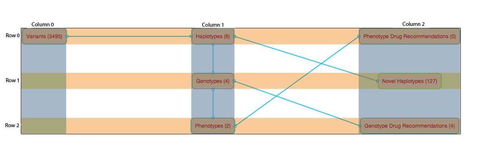
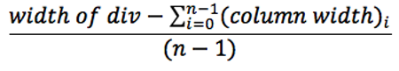
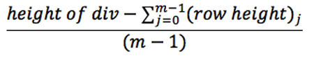
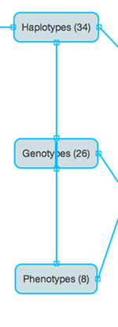

Dependency Graph
****************

The dependency graph is displayed for each job and on the create page.

How the graph layout is created
===============================

Calculating the level of each target
++++++++++++++++++++++++++++++++++++

The level of a target is the length of the shortest path from that target to a target with no dependents.

The path length is equal to the number of arrows/ line connectors.

This implies targets with no dependents have level zero.

For example in the graph bellow the variant target has these paths to level zero targets

    - (Variant -> Haplotypes -> Novel Haplotypes) length 2
    - (Variant -> Haplotypes -> Genotypes -> Genotype Drug Recommendation) length 3
    - (Variant -> Haplotypes -> Genotypes -> Phenotypes -> Phenotype Drug Recommendation) length 4

Therefore the variant target has level 2.

TODO: reference Dependency.groovy

The code for calculating node levels is in pipeline.js under the DependencyGraph model.

.. toctree::
    pipelineJs

Positioning of the Targets
++++++++++++++++++++++++++

The targets of the graph are displayed in an m-by-n grid.

 

n **=** number of columns **=** var numlevels **=** (maximum target level) + 1 

m **=** number of rows **=** the maximum number of targets in a level

column number of target = (n - 1) - target's level 

(column width) :sub:`i` **=** maximum target width in column i

(row height) :sub:`j` **=** maximum target height in row j

horizontal space between columns =

vertical space between rows =

Issues you may encounter
++++++++++++++++++++++++

The target's level is used to determine which column it goes in, but which row the target is placed is arbitrary.
This causes issues in the appearance of the graph. Some cases are if a target depends on two other targets in its column or
if a target depends on another target in the same level but they are not placed in adjacent rows.

For example if Phenotypes, Genotypes, and Haplotypes have the same level, and Phentoypes is dependent on genotypes and 
haplotypes the graph may appear like this:

What the dependency graph does with input files
===============================================
...

