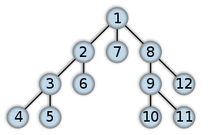
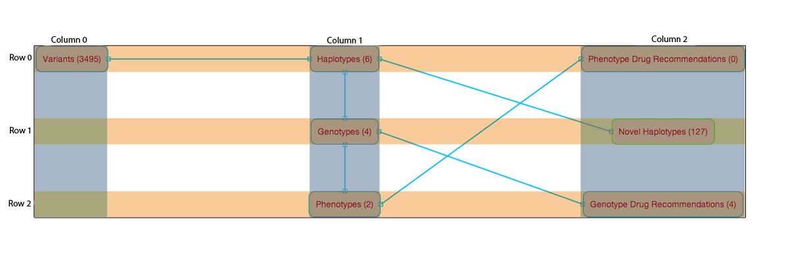
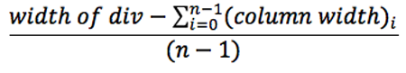
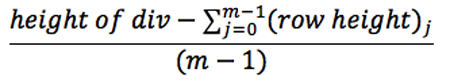
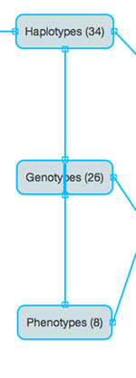

Dependency Graph
****************

The dependency graph is displayed for each job and on the create page.

How the graph layout is created
===============================

Calculating the level of each target (Column Level)
+++++++++++++++++++++++++++++++++++++++++++++++++++

The level of a target is the length of the shortest path from that target to a target with no dependents.

The path length is equal to the number of arrows/ line connectors.

This implies targets with no dependents have level zero.

For example in the graph bellow the variant target has these paths to level zero targets

    - (Variant -> Haplotypes -> Novel Haplotypes) length 2
    - (Variant -> Haplotypes -> Genotypes -> Genotype Drug Recommendation) length 3
    - (Variant -> Haplotypes -> Genotypes -> Phenotypes -> Phenotype Drug Recommendation) length 4

Therefore the target variant has level 2.

The code for calculating the column level can be found here in the levels function:

.. toctree::
    src-link/Dependency

Calculating the Row Level of each target
++++++++++++++++++++++++++++++++++++++++

The following is used to calculate the row levels of each column's targets:

1. The targets that do not depend on any other targets in the column are found and assigned unique groups by alphabetical order

2. For these targets, numberNodes is applied to them which assigns vertical numbers to all the dependants using Depth first search

3. numberNodes also assigns the starting target's group level to all the dependant targets

4. The targets are then sorted into groups and then sorted by vertical number 
5. The groups are joined into one list
6. The list is then converted to a map, which maps Dependency to rowLevel

The code for calculating the row levels can be found here in the rowLvls function:

.. toctree::
    src-link/Dependency

Hard Coding Column Level and Row Level
++++++++++++++++++++++++++++++++++++++

In the case that you would want to set the position of a target, it can be hard coded when defining the depGraph model in:

.. toctree::
    src-link/PipelineJobDepGraph

Instead of

.. sourcecode:: groovy 
 
    Map<Dependency, Integer> level = Dependency.levels(dependencies.values())
    Map<Dependency, Integer> rowLevel = Dependency.rowLvls(dependencies.values() as Set)

Assign the columnLevel and rowLevel based on how you would like the graph to appear

.. sourcecode:: groovy
     
    Map<Dependency, Integer> level = [dependency1: columnLevel, ..., dependencyN:columnLevel]
    Map<Dependency, Integer> rowLevel = [dependency1: rowLevel, ..., dependencyN: rowLevel]

Remember the column number of a target = ( total number of columns - 1) - target's column level

Positioning of the targets
++++++++++++++++++++++++++

The targets of the graph are displayed in an m-by-n grid.

 

n **=** number of columns **=** var numlevels **=** (maximum target level) + 1 

m **=** number of rows **=** the maximum number of targets in a level

column number of target = (n - 1) - target's level 

row number of target = target's rowLevel

(column width) :sub:`i` **=** maximum target width in column i

(row height) :sub:`j` **=** maximum target height in row j

horizontal space between columns =

vertical space between rows =

Issues you may encounter
++++++++++++++++++++++++

Although the targets are placed by their column level and row level, an issue arises when two targets depend on one starting target in the same column.

For example if both Genotypes and Phenotypes are dependant of Haplotypes the Graph will apper like so. The line connecting Haplotypes and Phenotypes goes 
straight through Genotypes instead of going around it. jsPlumb Library may have curved lines that will go around the targets.

Another issue is if a target's column level is less than its dependant's, meaning its column number is greater than its dependant's column number.

For example the dependencies A,B,C, and D with dependants[A]=[B,D], dependants[B]=[C], dependants[C]=[D], dependants[D]=[] 
will have columnLevels [D:0,A:1,C:1,B:2].
This means B will appear on the left of A, even though B depends on A.

