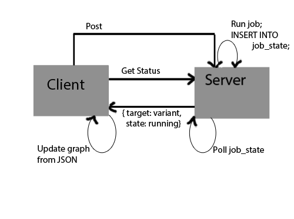

.. haplorec-wui-documentation documentation master file, created by
   sphinx-quickstart on Wed Jul 24 09:47:10 2013.
   You can adapt this file completely to your liking, but it should at least
   contain the root `toctree` directive.

Job Status Feature
******************

The Job Status feature allows the user to see the progress of a new Job being created. It shows each part of the dependency graph as it loads on the job's create and show page.

Assumed Background
==================
- Web frameworks/programming
- JS/Groovy
- web technology
    * HTTP protocol
        - methods:
            * post
            * get
        - synchronous/ asynchronous requests    

The Process
===========

When the user fills out the create page and clicks the create button the client sends out two request concurrently.

* a asynchronous POST to the pipelineJob/create?jobName=somejob.
    Once the server receives the POST request it starts to create the job by building the targets.

    .. sourcecode:: sql

        INSERT INTO job_state (target, states) VALUES (variant, running); 

    Once the server finishes building the target variant it updates the state,
    and does the same for the rest of the targets.

    .. sourcecode:: sql

        UPDATE states = done WHERE target = variant; 
  

* a GET request for pipelineJob/status?jobName=somejob 

    When the server receives the GET request for pipelineJob/status?jobName=somejob

    .. sourcecode:: sql
 
        status=SELECT target, states FROM job_state;

    .. sourcecode:: none

        for t,s in status
            if state s has changed for target t
                send JSON to client
            if t  has the state failed or was the last target
                stop and terminate GET request, sleep for 1 second and then poll again

            
    The client updates the dependency graph as each JSON is received.
    

Relevant Code
=============

.. toctree::
    
    PipelineJob
    show
    create
    Jsonstream 
