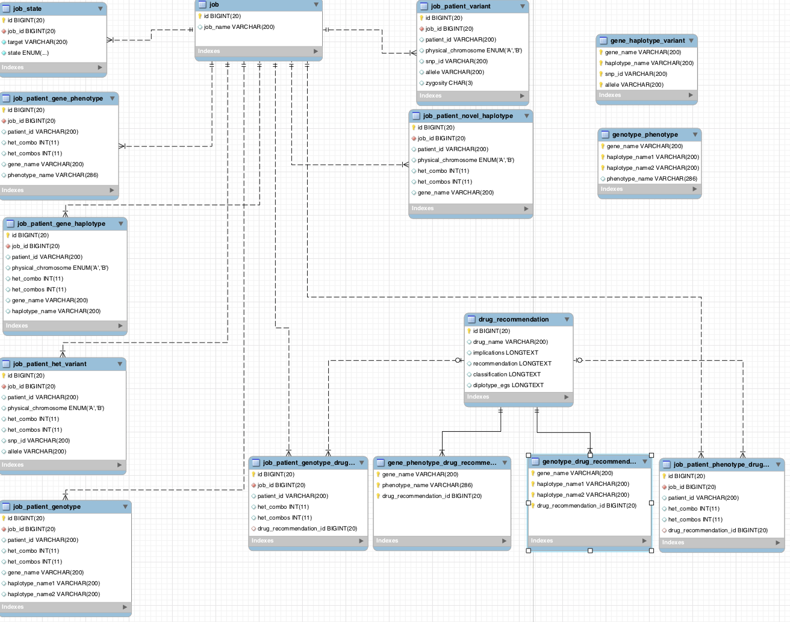

Overview
********

Code is split across haplorec and haplorec-wui in the following way:

**haplorec**: backend
  * scraping data from pharmgkb
  * validating pipeline input
  * running stages of the pipeline for a job using input (streams / files / iterable data) for 
    dependencies in the graph
  * saving results of each pipeline stage into the appropriate table
  * generating reports for a job
  * algorithms for mapping a dependency graph onto a cartesian coordinate system

**haplorec-wui**: web user interface
  * creating a job from files submitted in a form
  * viewing the status of a running job
  * viewing the results of different stages
  * downloading reports for a job

haplorec
========

Stages
------

The stages of mapping patient variants to drug recommendations are modelled as a dependency 
graph, where the stages are:

* *variants -> haplotypes*
* *variants -> novel haplotypes*
* *haplotypes -> genotypes*
* *genotypes -> phenotypes*
* etc.

The result of each stage is saved to a table, which is named like ``job_patient_*``.  For 
example, *variants -> haplotypes* is stored in ``job_patient_gene_haplotype``.

The code for running each stage are defined as functions in 
``src/groovy/haplorec/util/pipeline/Pipeline.groovy``:

.. literalinclude:: ../projects/haplorec/src/groovy/haplorec/util/pipeline/Pipeline.groovy
    :language: groovy
    :start-after: SPHINX: stage definitions
    :end-before: END SPHINX

The dependency relationships between the outputs of various stages are constructed in 
``Pipeline.dependencyGraph``:

.. literalinclude:: ../projects/haplorec/src/groovy/haplorec/util/pipeline/Pipeline.groovy
    :language: groovy
    :start-after: SPHINX: wire up the dependency graph
    :end-before: END SPHINX 

The ``rule`` property of each dependency is not included here. 

``rule`` is added to the dependencies during ``Pipeline.pipelineJob`` (when input for running a new job is given):

.. literalinclude:: ../projects/haplorec/src/groovy/haplorec/util/pipeline/Pipeline.groovy
    :language: groovy
    :start-after: SPHINX: add rules to dependency graph
    :end-before: END SPHINX 

Database
--------

Some general notes on the schema:

* ``job*`` tables are populated each time a new job is run
* the rest of the tables (``drug_recommendation``, ``genotype_drug_recommendation``, ``gene_phenotype_drug_recommendation``, ``gene_haplotype_variant``, ``genotype_phenotype``) are populated from :ref:`scraping_pharmgkb`
* ``job_patient_*`` tables refer to ``job`` through ``job_id``
* ``job_patient_genotype_drug_recommendation`` and ``job_patient_phenotype_drug_recommendation`` refer to ``drug_recommendation`` through ``drug_recommendation_id``

haplorec-wui
============

Most of the complexity in haplorec-wui is in ``web-app/js/pipeline.js``, which is where the logic 
for laying out a dependency graph in a cartesian coordinate system is implemented.

The javascript code is provided with the cartesian coordinates for laying out nodes in the graph 
(where the x coordinate is the ``level``, and y coordinate is the ``rowLevel``), and the coordinates 
themselves are calculated in ``haplorec.util.dependency.Dependency``.

The details of laying out the graph and calculating cartesian coordinates are well documented in 
:ref:`dependencyGraph` as well as in ``web-app/js/pipeline.js``.
